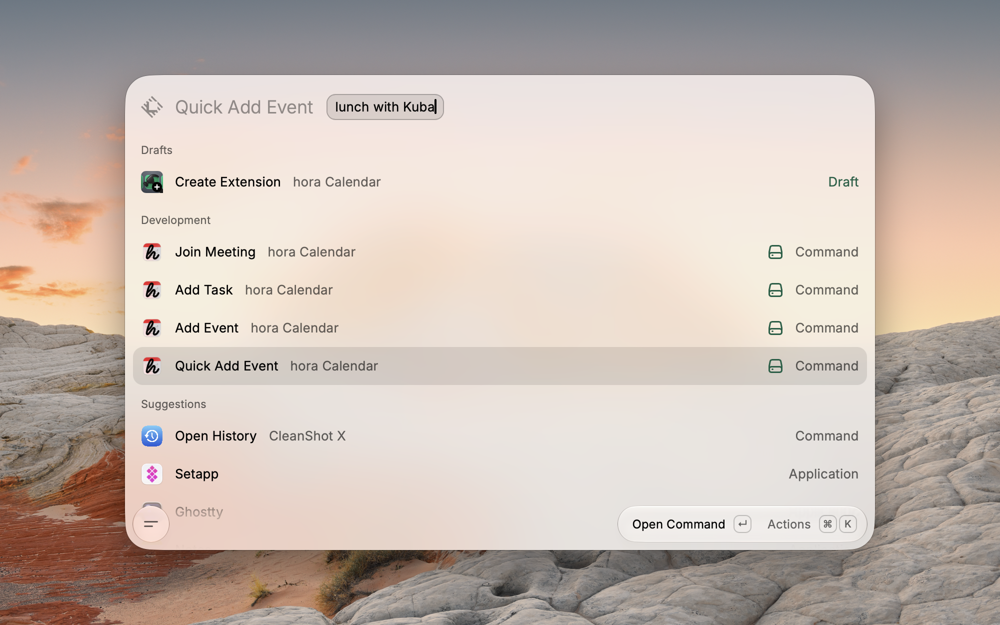
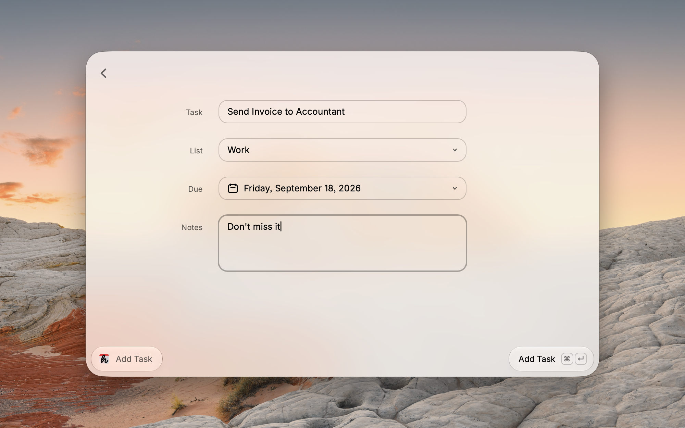

# hora Calendar in Raycast

Put an event in your calendar by describing it, add a task, or jump into your next call — without leaving Raycast, and usually without hora ever coming forward.

- [hora Calendar in Raycast](#hora-calendar-in-raycast)
  - [Quick Add Event](#quick-add-event)
  - [Add Event](#add-event)
  - [Add Task](#add-task)
  - [Join Meeting](#join-meeting)
  - [Choosing a calendar](#choosing-a-calendar)
  - [Requirements](#requirements)
  - [Preferences](#preferences)
  - [How it talks to hora](#how-it-talks-to-hora)
  - [Contributing](#contributing)

## Quick Add Event

Type `quick add event` and then describe the event the way you would say it out loud — `lunch with Kuba on Thursday at 1pm`, `standup tomorrow 9:30`, `dentist next Friday`.



Press Enter and it is in your calendar. hora does not open, does not take focus, does not flash a window at you — all you get is a toast confirming the title and the time it landed on.

The sentence is parsed by hora itself, not by this extension, so you get exactly the result you would get by typing the same thing into the app.

## Add Event

`add event` takes the same sentence, but instead of saving it, hora comes forward with its editor already filled in from what you typed. Nothing is saved until you save it.

Reach for this one when the sentence is doing a lot of work — several guests, an unusual date, a meeting link to attach, a description to write. The parser does the first 80%, you do the rest.

## Add Task

`add task` opens a small form: the task, which of your Google Tasks lists it belongs to, when it is due, and a note.



The list dropdown is filled from the lists hora has actually synced, and it starts on the same default list hora uses when you add a task from its sidebar. Google Tasks records the day only, never a time of day, which is why there is a date picker and no clock.

## Join Meeting

`join meeting` lists what is coming up that you can actually join — anything with a Google Meet, Zoom or Teams link.


Each row shows which account the meeting belongs to and how soon it starts: `in 20 min` while it is close, the time while it is still today, the weekday after that. Press Enter and the call opens in the right app, signed in as the right Google account — which matters if you keep work and personal accounts side by side. `⌘ ⇧ C` copies the link instead.

## Choosing a calendar

Quick Add Event writes to the calendar set under **Default Calendar** in the extension's preferences. Leave it empty and events land on the primary calendar of your first connected account.

To put one event somewhere else, use **Add Event** and pick the calendar in hora's editor before saving.

## Requirements

- macOS, and **hora Calendar 1.1.5 or newer**. Earlier versions have no scripting support, so every command will fail.
- Permission for Raycast to control hora. macOS asks the first time you run a command. If you dismissed that prompt, turn it back on under **System Settings › Privacy & Security › Automation › Raycast** — the extension will offer to open that pane for you.

hora ships through the App Store, Setapp and directly from the website. The extension finds whichever one you have installed; there is nothing to configure.

## Preferences

| Preference | What it does |
| --- | --- |
| **Default Calendar** | The calendar Quick Add Event writes to. Empty means the primary calendar of your first connected account. |
| **Close Raycast after adding** | Dismiss the Raycast window as soon as a quick add is sent. On by default. |

## How it talks to hora

Everything goes through hora's AppleScript dictionary — no private APIs, no reading hora's files, nothing that breaks when hora updates. You can drive the same commands yourself:

```applescript
tell application id "szamowski.Hora"
    parse sentence "lunch with Kuba on Thursday at 1pm" with add immediately
    add task "send the invoice"
    upcoming events limited to 10 with meeting links
end tell
```

Every command answers with JSON. Open the full dictionary in Script Editor with **File › Open Dictionary…** and pick hora Calendar — there is more in there than this extension uses, including RSVPs and deleting events.

## Contributing

Fork [the repository](https://github.com/szamowski-dev/hora-raycast) and open a pull request describing what you changed. Issues and suggestions are welcome too.

Run it locally with:

```bash
npm install
npm run dev
```

You will need hora installed for anything to work.
